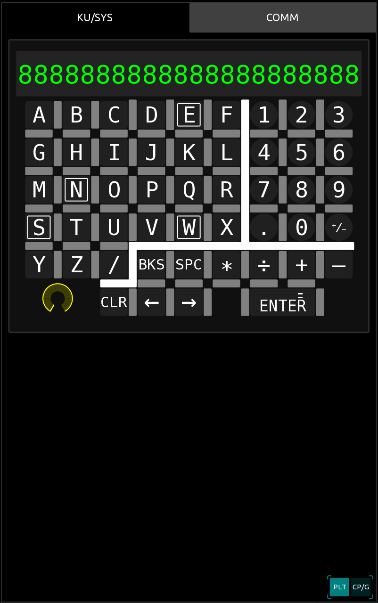
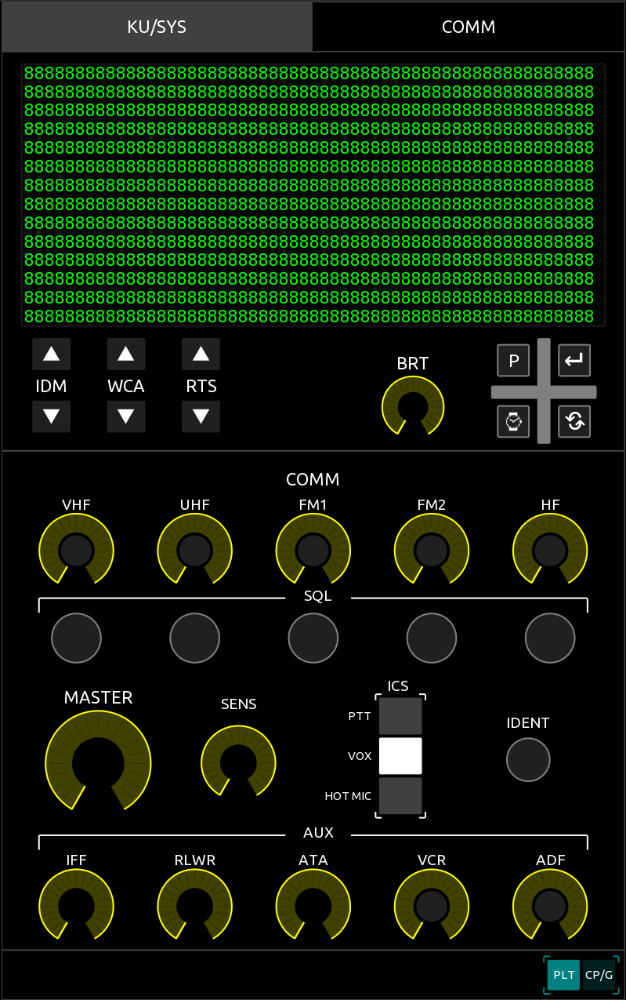

The AH-64D layout can be toggled between the Pilot and the CP/G in the bottom right. Both layouts feature the KU, EUFD, and comm panel. The brightness knob also controls text brightness on the layout itself.

## KU

## EUFD/Comm panel

