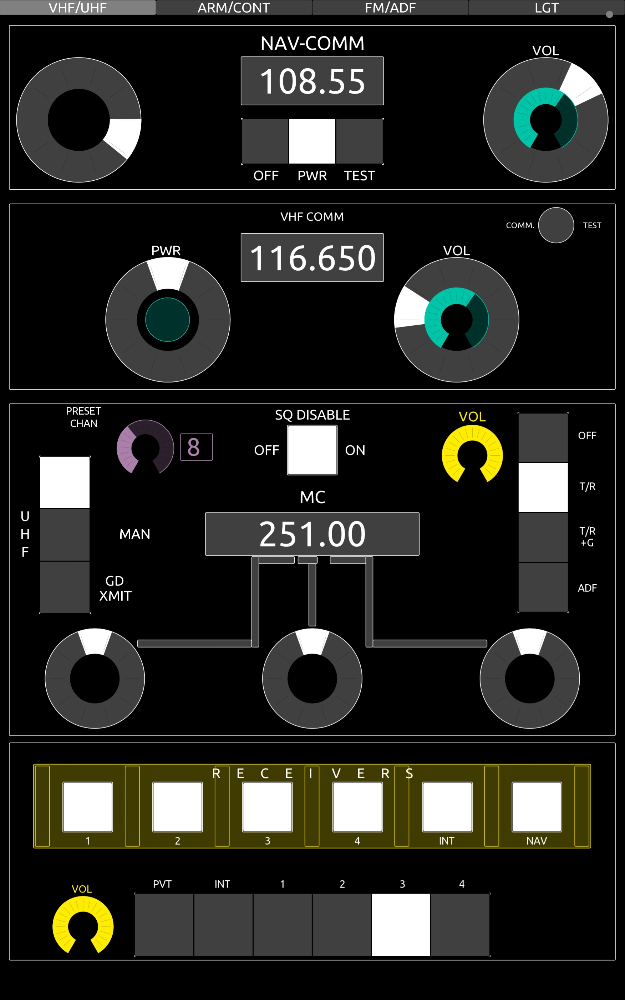
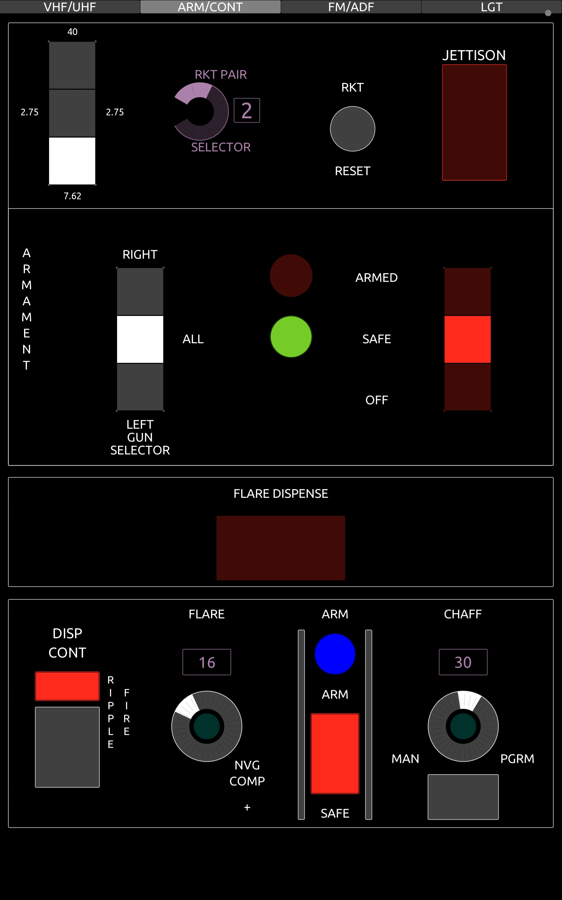
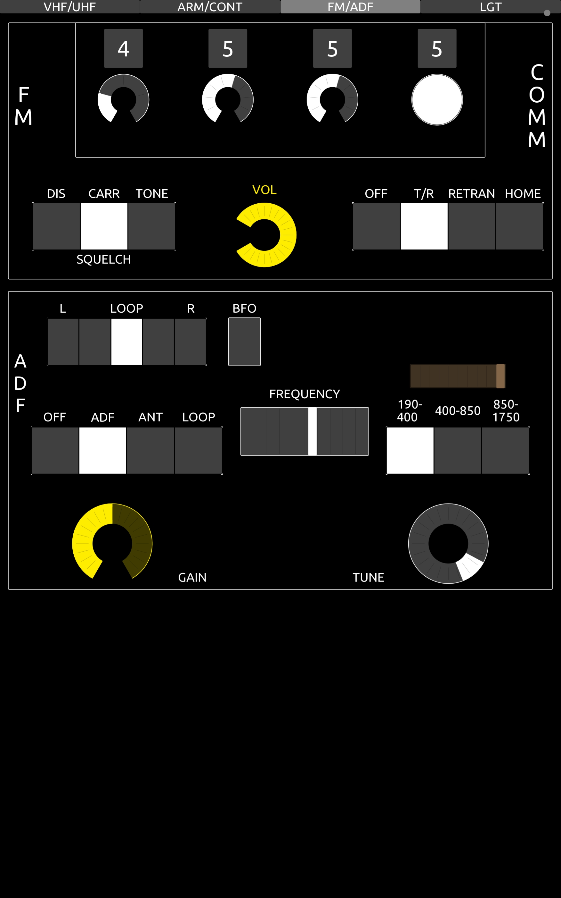

The UH-1H layout features four pages of controls covering most of the critical buttons and switches within the upper and lower center consoles of the aircraft.

## VHF/UHF Radios

## Armament/Countermeasures

## FM/ADF Radios

## Lighting

