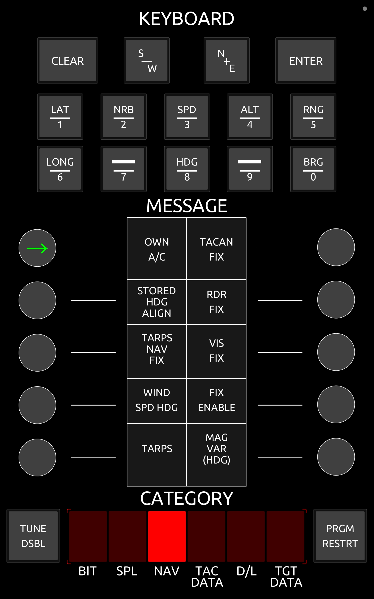
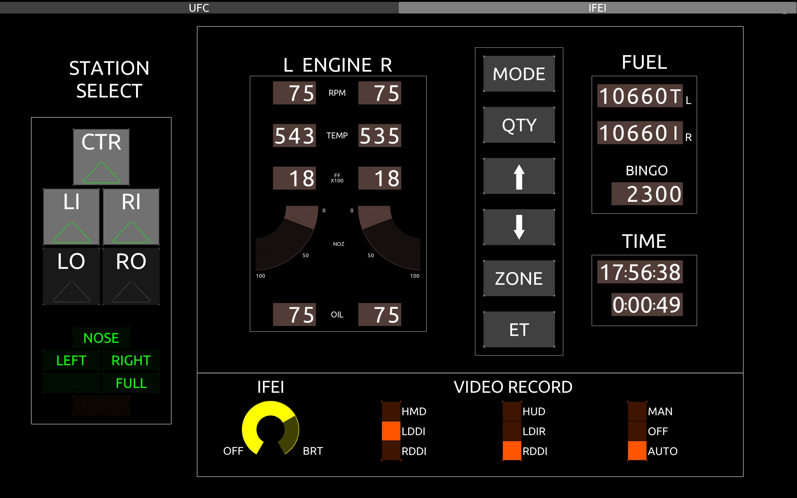
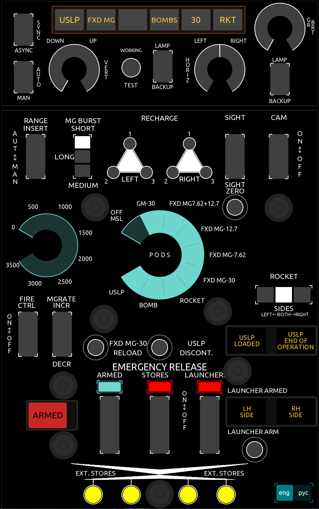
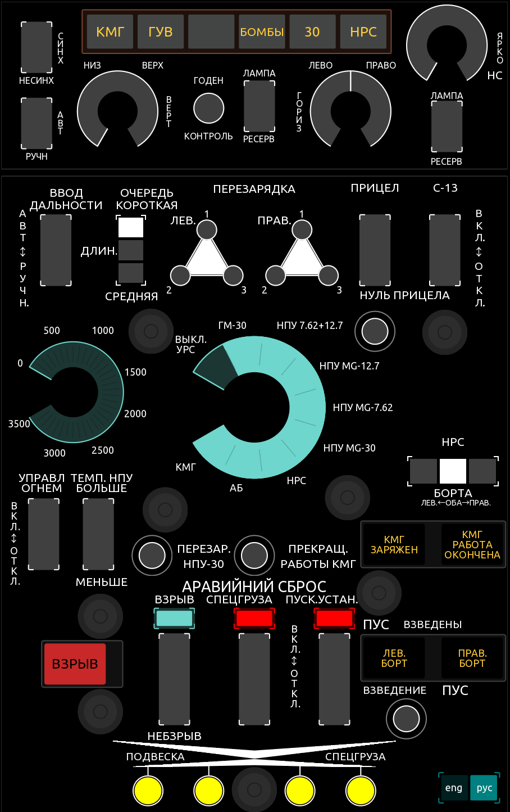

This repo contains a collection of layouts I have made since writing [TouchDCS](https://github.com/charliefoxtwo/TouchDCS). Some are better than others (depending on my interest in the aircraft and when the layout was made), but hopefully this repo can serve as a starting point for anybody looking to build their own layout.

## Instructions
If you're not familiar with git, you can download the entire repo by clicking Code > Download ZIP. 

## Aircraft included

### AH-64D Apache

### AJS-37 Viggen

### F-14B Tomcat

### F/A-18C Hornet

### Mi-24P Hind

### UH-1H Huey

## Contributing

With any contribution, please include:
 - The `.tosc` file
 - The `.xml` file (In TouchOSC, go to File > Export > XML)
 - An image of the layout (replacing the existing image if applicable)

### Style
If you have an issue with the style of a layout (some could definitely use some work) please open an Issue in the Issues section of Github. I'm particularly picky about the styles of my layouts, but I'm also open to making changes if they seem beneficial.

### Functionality
Contributions fixing functionality are very much welcome!

Broken functionality is defined as a case where a control does not function properly (that is, it does not send data and/or receive data correctly).

## FAQ

### I don't see a layout for my aircraft, how can I get one?
TouchDCS was designed with the idea that anybody can (and should) make their own layout! I recommend looking at the layouts I (and others) have written to help understand how everything works.

### But I really just want you to make the layout.
You're welcome to open an Issue in the Issues section, but I can't promise anything. The layouts I've made so far have all been for aircraft I am or at one point was actively flying. I don't own all modules, and even many of the modules I _do_ own I don't have extensive knowledge of.
